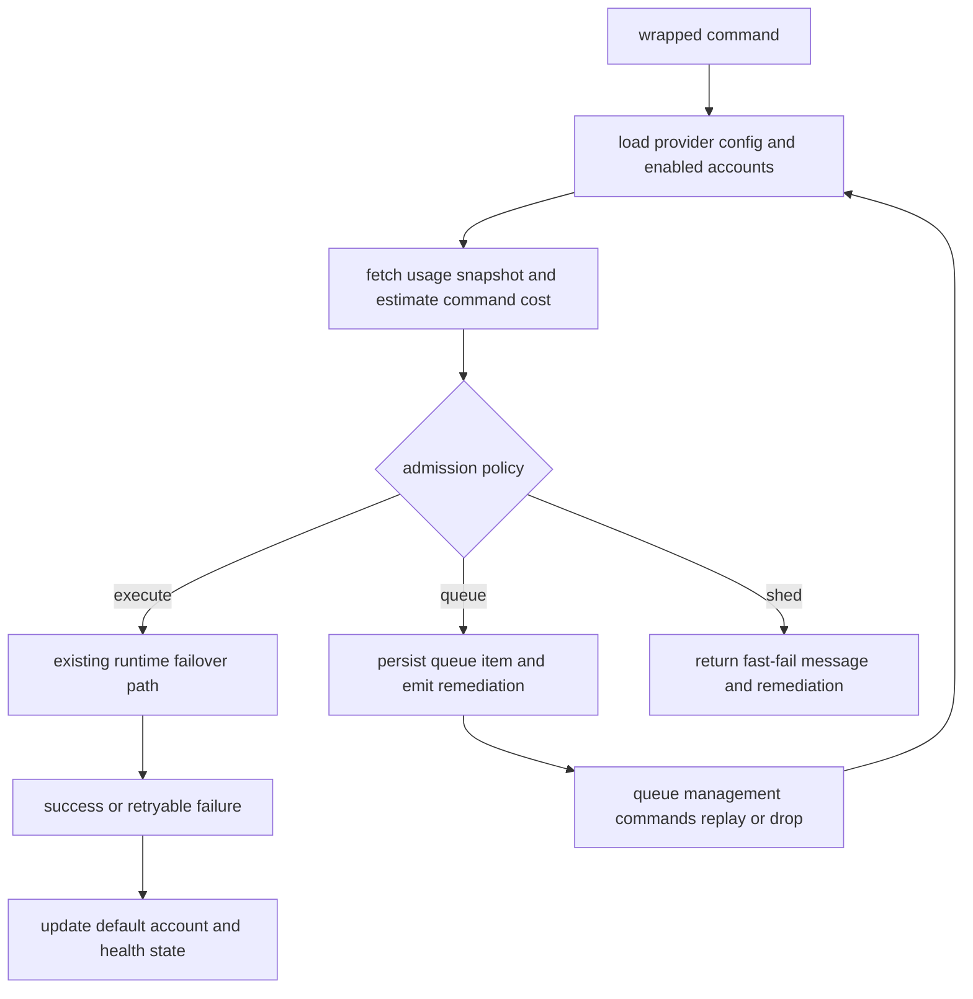
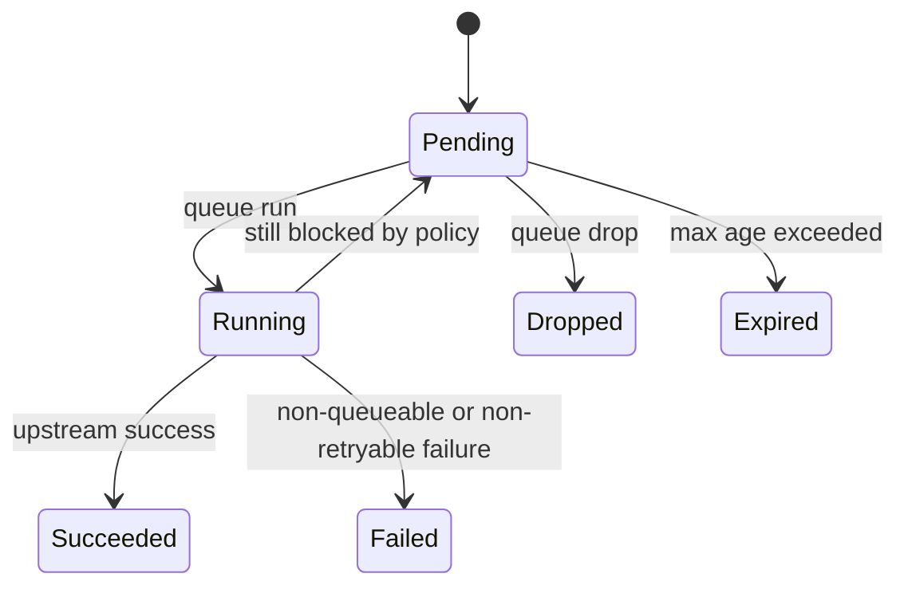

# Quota-aware admission control and backpressure

## Goal

Extend `clifwrap` so it can decide *before* calling the upstream CLI whether to run, queue, or reject a command — instead of only reacting after quota is already spent or a retryable failure comes back.

The wrapper already rotates accounts, watches fallback pools, and reads provider usage. This work adds acting on that data upstream of the CLI invocation.

**Authority:** This plan governs quota-aware scheduling and backpressure in this repo. Existing low-fallback monitoring stays unless a unit below says otherwise.

**Default policy:** Because no one picked a global default for low-capacity behavior, the first ship uses configurable policy with a safe global default and per-provider overrides — not one hardwired behavior everywhere.

**Done when:** The wrapper can preflight capacity, make a documented admission decision, persist queued work, expose queue and remediation state through wrapper commands, and keep current passthrough/failover behavior for providers that do not opt in.

---

## Product contract

### Summary

Stop waiting for provider CLIs to fail on exhausted quota. Estimate whether a wrapped command can run against the current account pool, then execute, queue, or reject based on policy. Tell the operator what to do next through approved provisioning paths.

### Problem

Today the wrapper reacts only after upstream failure or when status shows a low fallback pool. That leaves gaps:

- Quota gets spent on requests we could have predicted would fail.
- No durable, generic way to defer work until capacity returns.
- Remediation lives in operators' heads, not in the wrapper.

This touches provider config, state, runtime flow, wrapper commands, and health reporting.

### Requirements

- R1. Pre-request admission control before the upstream CLI runs.
- R2. Generic core driven by provider metadata + user config + env overrides — no provider-name branches in runtime.
- R3. At least three outcomes: execute now, queue for later, fail fast with a clear reason.
- R4. Capacity evaluation uses existing usage lookups, configurable cost estimates, and conservative behavior when usage is stale or unknown.
- R5. Queued work survives process exits, replays idempotently, and is manageable through wrapper CLI commands.
- R6. Status and health expose low capacity, queue backlog, and approved remediation paths — without automating account creation.
- R7. Existing failover, low-fallback alerts, interactive passthrough, install idempotency, and passthrough for unconfigured providers keep working.
- R8. ScrapeCLI and SearchCLI both use the same control plane even if cost rules differ.

### Success criteria

- Wrapped commands can be blocked or deferred before upstream execution when projected capacity is insufficient.
- Queueable work can be listed, replayed, and dropped without hand-editing state files.
- Health output distinguishes low fallback pool, low capacity, expired queued work, and failed recovery hooks.
- New providers need only metadata or config changes — no new hardcoded runtime branches.

### Scope

**In scope:** Preflight capacity checks, execute/queue/shed policy, durable queue state and commands, status/remediation output, ScrapeCLI and SearchCLI metadata + tests.

**Follow-up (not this ship):** Background daemons that drain queues without an explicit command; billing parity for every subcommand; automatic account provisioning.

**Out of scope:** Replacing the failover engine, rewriting auth-management flows, building a hosted control plane.

### Assumptions

- Provider usage endpoints remain the source of truth for remaining capacity.
- Wrapper state under `~/.local/state/clifwrap/` stays the persistence root for queue and capacity data.
- Users who want automatic draining can call wrapper commands from cron, systemd timers, or another scheduler.

---

## Technical decisions

- **KTD1.** New scheduling module instead of more policy code in `runtime.py`. Failover, status, and managed-auth already live there; admission and queues add enough state to warrant a separate boundary.

- **KTD2.** Policy + estimates, not exact billing simulation. ScrapeCLI and SearchCLI expose usage but real billing varies by command shape. Conservative estimates + unknown-capacity policy beat pretending we mirror provider billing.

- **KTD3.** Queue draining through explicit CLI commands, not a daemon. Idempotent, testable, low carry cost; schedulers can automate drains.

- **KTD4.** Remediation is human-approved and config-driven. Surface docs, commands, and messages — do not auto-create accounts.

- **KTD5.** Keep low-fallback monitoring; add capacity health alongside it. Low fallback count and low usable quota are related but distinct signals.

### Flow

Admission runs before `_run_attempts()` invokes upstream. Policy is provider-configurable with per-command overrides and a separate unknown-capacity rule. Queue persistence uses state files plus wrapper-only CLI subcommands.

### Open questions (deferred)

- Global default: `queue` vs `shed` for commands without an explicit override. Ship configurable; do not block on one default.
- Whether queue backlog affects `status --check` immediately or only past age/count thresholds.

### Risks

| Risk | Mitigation |
| --- | --- |
| Bad estimates over-block work | Unknown-capacity policy, per-command overrides, conservative metadata, test allow and block paths |
| Queue replay duplicates intent or drifts from env | Persist argv, provider, admission metadata, timestamps, replay count; validate before replay; drop/inspect commands |
| Runtime complexity breaks failover | New module; call existing attempt engine only after admission; extend tests, do not replace |
| Remediation becomes provider hardcoding | Hints and commands in config/metadata; generic render helpers |

### Sources

- SearchCLI: Bearer auth, documented `GET /usage` for preflight.
- ScrapeCLI: API-key auth, CLI-visible credit usage, aligns with existing usage config.
- Repo patterns: state in `state.py`, env overrides, failover messaging, health in `runtime.py`; tests in `tests/test_wrapper.py`.

---

## Implementation units

### U1. Capacity-control config

Add a generic config model for admission policy, cost estimation, queue behavior, and remediation.

**Files:** `config.py`, `providers.toml`, `__main__.py`, `README.md`, `tests/test_wrapper.py`

Follow the existing `fallback_monitor`, `auth_management`, and `usage` layering in `config.py`.

**Verify:** One provider config path shows policy, estimation, and remediation without provider-name branches in the config layer.

### U2. Admission and capacity engine

Preflight engine: usage snapshots + command estimates → execute, queue, or shed.

**Files:** `runtime.py`, `state.py`, `scheduling.py`, `tests/test_wrapper.py`

Start with unit tests on the decision engine before threading into `run_app()`.

**Verify:** Engine runs entirely in tests with mocked usage; stable decision objects for runtime without inspecting provider names.

### U3. Queue persistence and commands

Durable queue under wrapper state; `clifwrap queue list`, `run`, `drop` with JSON where useful.

**Files:** `state.py`, `scheduling.py`, `__main__.py`, `README.md`, `tests/test_wrapper.py`

**Verify:** Inspect, replay, and drop queued work through wrapper commands alone; items survive restarts.

### U4. Runtime and health integration

Admission after managed-auth, before upstream execution. Extend status with capacity, backlog, remediation. `status --check` reports low capacity and queued work without conflating with low fallback count.

**Files:** `runtime.py`, `__main__.py`, `providers.toml`, `README.md`, `tests/test_wrapper.py`

**Verify:** Clear separation between execute, queue, shed, and existing retry-after-failure paths.

### U5. Provider defaults, remediation, regression coverage

Conservative ScrapeCLI and SearchCLI policies, documented cost assumptions, remediation fields pointing to operator actions. Tests for backward compatibility and metadata loading.

**Files:** `providers.toml`, `README.md`, `tests/test_wrapper.py`

**Verify:** One coherent user story for both providers plus generic extension points; legacy behavior tests still pass.

---

## Verification

| Gate | Expectation |
| --- | --- |
| `pytest tests/test_wrapper.py` | Config, admission, queue lifecycle, runtime integration, status health, backward compatibility |
| Focused tests during work | Isolate config, admission, queue, status so failures point to one seam |
| Manual smoke | `clifwrap status` and queue commands match documented flow without state-file edits |
| Legacy regression | Failover, low-fallback, auth-management, passthrough login, install idempotency unchanged |

---

## Definition of done

- Generic capacity-control model, admission engine, durable queue state, queue CLI commands.
- ScrapeCLI and SearchCLI on the new control plane without provider-label branches in core runtime.
- `status` and `--check` surface low capacity and queued work alongside low-fallback and recovery-hook signals.
- Tests cover healthy execution, alternate-account execution, queue, shed, unknown capacity, replay, expiry, backward compatibility.
- README explains policy config, backlog inspection, replay, and provisioning guidance.
- Remove abandoned scheduling experiments or duplicate policy paths before calling the work complete.
