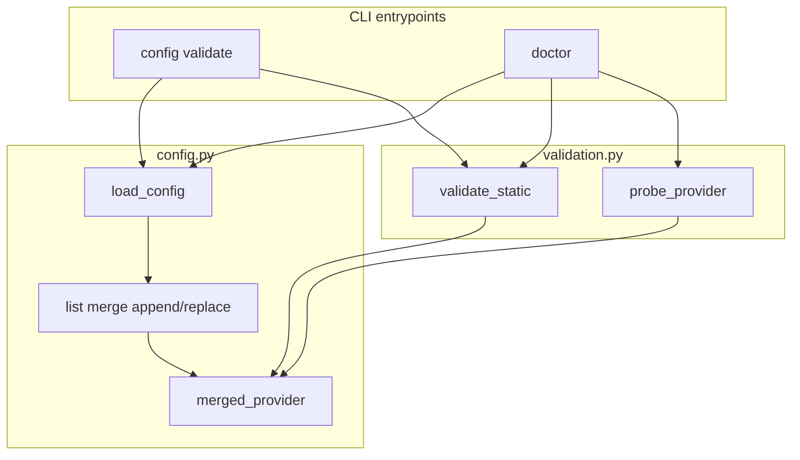

## Summary

Extend clifwrap so operators can add and customize providers safely before runtime failure. Ship static and live provider validation through existing `config validate` and `doctor` commands, append-by-default catalog list merge with explicit replace opt-in, a template catalog provider, and a provider authoring guide.

---

## Problem Frame

Today `config validate` only checks that user TOML parses; `doctor` inspects shims, defaults, and queue state on raw user config. Neither uses `merged_provider()`, so catalog defaults and effective retry/passthrough rules are invisible until a wrapped command fails. List fields use Python `or` merge — a non-empty user list replaces the entire catalog list. Only `searchcli` and `scrapecli` exist as catalog examples with no authoring guide.

(see origin: `docs/brainstorms/2026-07-25-extensibility-requirements.md`)

---

## Requirements

Traceability to origin R-IDs. Implementation must satisfy all.

- R1. `config validate` reports provider-level issues beyond parse errors: missing accounts, unresolvable env refs, invalid merge declarations, malformed metadata.
- R2. `doctor` includes per-provider validation summary with remediation hints.
- R3. Live probe validates usage URL or `status_command` JSON shape and retry rule syntax without mutating config.
- R4. Validation messages name provider, config location, and next fix command.
- R5. Unreachable usage endpoints warn by default; `--check` fails with nonzero exit.
- R6. Catalog list fields append user entries by default.
- R7. Users can opt into full list replacement.
- R8. Merge rules documented in `docs/configuration.md` with examples.
- R9. `docs/provider-authoring.md` covers catalog vs config-only providers.
- R10. Template catalog provider demonstrates optional fields with safe placeholders.
- R11. Generated `docs/provider-catalog.md` includes the template provider.

**Flows and acceptance examples (origin F1, F2, AE1–AE3)** are enforced via U2–U5 test scenarios.

---

## Key Technical Decisions

- **KTD1 — Dedicated validation module:** Add `src/clifwrap/validation.py` for static and probe logic. Keeps `__main__.py` thin and testable without provider name literals in generic modules (see `tests/test_wrapper.py` anonymity test).
- **KTD2 — Append + explicit replace keys for lists:** User `retry_patterns = ["c"]` appends to catalog defaults. User `retry_patterns_replace = ["c"]` replaces entirely. Same pattern for `never_retry_patterns`, `retry_exit_codes`, `passthrough_commands`, and nested lists exposed at provider level (`auth_aliases`, `capacity_remediation_commands` as optional replace siblings where catalog merge applies). Rationale: TOML-native, no magic prefixes, backward-compatible when user omits lists (catalog only).
- **KTD3 — Validate effective merged config:** Both `config validate` and `doctor` iterate providers present in user config **and** call `merged_provider(name, raw)` so catalog-backed providers reflect runtime behavior. Catalog-only providers with no user accounts are skipped unless `--provider` is set.
- **KTD4 — Probe scope:** Live probe runs against the default enabled account per provider, falling back to first enabled account. `--provider NAME` limits checks; `--all-accounts` (doctor only) probes every enabled account.
- **KTD5 — Severity model:** Findings carry `level` of `error` or `warning`. Static issues (missing env ref, no accounts, invalid replace key) are errors. Live probe failures (timeout, bad JSON, unreachable URL) are warnings unless `--check`.
- **KTD6 — Template provider name `examplecli`:** Ships in `providers.toml` with `*.example` hosts, minimal accounts none, documents every catalog subsection. Not intended for install/shim use; documented as reference-only in authoring guide.
- **KTD7 — No new top-level command:** Extend `config validate` and `doctor` per origin decision; optional `doctor --provider` filter only.

---

## High-Level Technical Design

Validation pipeline:

1. Load user config (fail fast on parse errors — existing behavior).
2. For each target provider, compute merged config via updated `merged_provider`.
3. Run static checks (accounts, env refs, duplicate names, replace-key consistency).
4. Optionally run live probe (HTTP GET for usage URL or subprocess for `status_command`).
5. Aggregate findings into validate/doctor payloads; apply `--check` exit policy.

---

## Implementation Units

### U1. Provider validation module

**Goal:** Centralize static and live provider validation with structured findings.

**Requirements:** R1, R3, R4, R5

**Dependencies:** None

**Files:**
- Create `src/clifwrap/validation.py`
- Modify `tests/test_wrapper.py`

**Approach:**
- Define `ValidationFinding` dataclass: `provider`, `field`, `level`, `message`, `remediation` (optional command string).
- `validate_provider_static(name, merged: ProviderConfig) -> list[ValidationFinding]`:
  - No enabled accounts → error
  - Per account: resolve `env` refs (`env:VAR`) — unset without `env_command` → error
  - Empty `retry_patterns` entries, invalid usage URL scheme → error
  - Duplicate account names → error
- `probe_provider(name, merged, account) -> list[ValidationFinding]`:
  - If `usage.url` set: HTTP GET with timeout (reuse runtime status HTTP helpers or extract shared fetch to avoid duplication — prefer extracting minimal shared helper over importing runtime side effects)
  - Elif `status_command`: run command, parse JSON for `remaining`/`limit`
  - Timeout/unreachable/invalid JSON → warning-level finding
- Keep all logic provider-name agnostic; use merged config fields only.

**Patterns to follow:** Dataclass style in `config.py`; no secrets in messages.

**Test scenarios:**
- Covers AE1. Static validation flags missing `env:MISSING` with provider and account in message.
- Static validation passes for well-formed `somecli` fixture config.
- Probe returns warning finding when usage URL points at unreachable host (mock or localhost closed port).
- Probe accepts valid JSON from fake `status_command` script (subprocess fixture pattern from existing failover tests).
- Findings never contain secret values in `message` or `remediation`.

**Verification:** Unit tests import `validation` directly; no provider literals in module source.

---

### U2. Append-aware catalog list merge

**Goal:** User list fields extend catalog defaults unless explicit replace keys are used.

**Requirements:** R6, R7, R8

**Dependencies:** None (can land before U1; tests should cover merge in isolation)

**Files:**
- Modify `src/clifwrap/config.py`
- Modify `tests/test_wrapper.py`
- Modify `docs/configuration.md`

**Approach:**
- Extend `_provider_from_raw` to read optional `*_replace` keys alongside list fields.
- Update `merged_provider` merge block:
  - If `retry_patterns_replace` set → use it; elif user `retry_patterns` non-empty → `catalog + user` deduped preserve order; else catalog.
  - Apply same pattern to `never_retry_patterns`, `retry_exit_codes`, `passthrough_commands`.
- Document keys in `docs/configuration.md` with AE3 scenario (patterns A,B + user C → A,B,C).
- Update `test_configuration_docs_cover_runtime_override_surface` tokens if new env/table keys added.

**Patterns to follow:** Existing `merged_provider` in `config.py`; env override layer remains full replace (unchanged).

**Test scenarios:**
- Covers AE3. Catalog patterns `["a","b"]` + user `retry_patterns = ["c"]` → effective `["a","b","c"]`.
- User `retry_patterns_replace = ["c"]` → effective `["c"]` only.
- Empty user list inherits catalog (existing behavior preserved).
- `somecli` generic provider name only in tests.

**Verification:** Direct `merged_provider()` assertions; doc contains "append" and "replace" examples.

---

### U3. Extend `config validate` and `doctor`

**Goal:** Wire validation into CLI commands with warn/check semantics and JSON payloads.

**Requirements:** R1, R2, R4, R5

**Dependencies:** U1, U2

**Files:**
- Modify `src/clifwrap/__main__.py`
- Modify `tests/test_wrapper.py`
- Regenerate `docs/cli-reference.md` via `scripts/generate_cli_reference.py --write`

**Approach:**
- Extend `_config_validate_payload`:
  - After successful parse, run `validate_provider_static` on each merged provider.
  - Add `findings: [{provider, level, message, remediation}]`, `warnings` count, `errors` count.
  - `valid=False` when any error-level finding exists.
- Extend `_doctor_payload`:
  - Add `validation` section per provider with static + probe findings.
  - Add `--provider NAME` argparse filter.
  - Add `--all-accounts` for probe fan-out.
  - `--check`: exit 1 if any error **or** any warning (includes probe failures per R5).
- Human output: print findings grouped by provider; include remediation line when present.
- JSON output: stable keys, no secrets (extend existing tests).

**Patterns to follow:** `_config_validate_payload` / `_doctor_payload` split; `--json` + `--check` conventions.

**Test scenarios:**
- Covers AE1. `config validate --json` reports missing env ref with remediation text.
- Covers AE2. `doctor` without `--check` exits 0 with probe warning; with `--check` exits 1.
- `doctor --json` includes validation section when shims healthy.
- Existing doctor shim/queue tests still pass unchanged.

**Verification:** `_run("config", "validate")` and `_run("doctor", "--check")` integration tests.

---

### U4. Template catalog provider

**Goal:** Add `examplecli` reference provider to built-in catalog and regenerate docs.

**Requirements:** R10, R11

**Dependencies:** U2 (uses merge fields in template)

**Files:**
- Modify `src/clifwrap/providers.toml`
- Regenerate `docs/provider-catalog.md`
- Modify `tests/test_wrapper.py` (if catalog section count asserted)

**Approach:**
- Add `[providers.examplecli]` with one entry per optional subsection (`auth_management`, `fallback_monitor`, `usage`, `capacity_control`), placeholder `*.example` URLs, sample retry patterns, comment in TOML that provider is documentation-only.
- Run `python scripts/generate_provider_catalog.py --write`.
- Ensure `scripts/check_anonymity.py` passes (example hosts only).

**Patterns to follow:** `searchcli` / `scrapecli` table layout in `providers.toml`.

**Test scenarios:**
- `test_generated_provider_catalog_is_current` passes after regeneration.
- `merged_provider("examplecli", None)` loads without error.
- Catalog doc contains `examplecli` heading.

**Verification:** `nox -s docs` check mode passes.

---

### U5. Provider authoring guide and doc integration

**Goal:** Document how to add providers and validate them before first use.

**Requirements:** R8, R9, F1

**Dependencies:** U2, U3, U4

**Files:**
- Create `docs/provider-authoring.md`
- Modify `docs/operations.md` (validation workflow: validate → doctor → install)
- Modify `docs/configuration.md` (merge section from U2)
- Modify `scripts/verify_release.py` required public docs list if needed
- Modify `tests/test_wrapper.py` doc coverage test if manifest enforced

**Approach:**
- Authoring guide sections: catalog vs config-only, field reference pointing to `providers.toml` + `examplecli`, validation workflow (F1 steps), common failure modes, PR checklist for new catalog providers.
- Link from `README.md` documentation table (one line — minimal scope).
- Add manifest entry in verify_release if other docs are enumerated.

**Patterns to follow:** Tone and structure of `docs/configuration.md`, `docs/operations.md`.

**Test scenarios:**
- Test expectation: none — documentation-only unit; verified by `verify_release.py` doc list and manual review.

**Verification:** Doc paths exist; links use repo-relative references; release verifier passes.

---

## Scope Boundaries

### Deferred to Follow-Up Work

- Python plugin / `providers.d` discovery (origin deferred)
- Splitting `runtime.py` (adjacent refactor, out of scope)
- `--json` schema command (automation track)

### Carried from origin — out of scope

- Reliability track (429 vs quota, audit JSONL)
- Security track (keyring)
- Windows shim strategy
- Proxy/dashboard architectures

---

## Risks and Dependencies

- **Merge behavior change:** Append semantics alter effective config for users who relied on full replace via non-empty lists. Mitigation: document in CHANGELOG; replace keys preserve old behavior explicitly.
- **Probe flakiness in CI:** Live HTTP probes must not run in default pytest (unit tests mock or use local fake servers only). Doctor probes are operator-initiated.
- **Runtime coupling:** Extract minimal HTTP/status parsing shared between validation and runtime to avoid duplicating logic or importing heavy runtime paths.

---

## Sources and Research

- Origin: `docs/brainstorms/2026-07-25-extensibility-requirements.md`
- Code: `src/clifwrap/config.py`, `src/clifwrap/__main__.py`, `src/clifwrap/providers.toml`
- Tests: `tests/test_wrapper.py` (`test_provider_specific_literals_stay_out_of_generic_wrapper_modules`, validate/doctor tests)
- External patterns: GitHub CLI `auth status` (--check, JSON), CLI Spec validation-before-mutation
