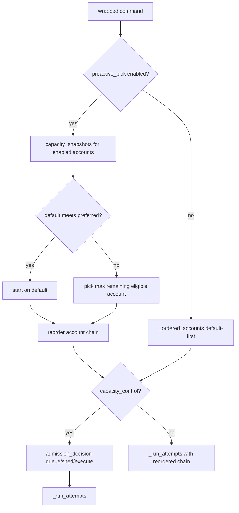

## Summary

Pick the best starting account before the first upstream call when quota data is available, so depleted defaults are skipped instead of burning a retry. Extend the existing scheduling snapshots and admission path rather than building a parallel picker.

---

## Problem Frame

clifwrap fails over reactively: `_ordered_accounts` rotates the persisted default to the front, and `_run_attempts` walks the list until a retryable error triggers the next account. Capacity admission can approve execution and even select a different account, but selection today prefers the active/default account when it barely clears the floor, and tie-breaking follows config order rather than highest remaining headroom.

Operators with `status_command` or usage URLs still pay at least one doomed upstream call when the default is nearly empty. The extensibility brainstorm deferred this work as the reliability track; this plan implements the headroom-first slice only.

---

## Requirements

- R1. Before the first upstream invocation, evaluate enabled accounts with usable capacity snapshots. (origin R1)
- R2. Keep the default account when its remaining quota is at or above `reserve_threshold + estimated_cost`. (origin R2)
- R3. When the default is below that threshold or capacity is unknown for the default, select the enabled account with the highest known remaining quota; ties break by config order. (origin R3)
- R4. Respect capacity-control policy: do not choose accounts below reserve unless policy allows execution with unknown or sub-reserve capacity. (origin R4)
- R5. Do not re-probe mid-request; starting account is fixed for the invocation. (origin R5)
- R6. Reactive failover after a retryable upstream error still walks the remaining account chain. (origin R6)
- R7. When the starting account differs from the default, emit a stderr notice naming the account and reason. (origin R7)
- R8. `status --json` and `doctor --json` expose per-account headroom and starting-account eligibility. (origin R8)
- R9. Per-provider opt-out via `proactive_pick = false`; default enabled when `status_command` or usage metadata exists. (origin R9)
- R10. Document `snapshot_ttl_seconds` trade-off in operations/configuration docs. (origin R10)

---

## Key Technical Decisions

- **KTD1: Extend `scheduling.py`, do not fork a second picker.** Add a `select_starting_account()` helper that consumes `CapacitySnapshot` lists and returns `(account_name, reason)`. Both `admission_decision` and a lightweight pre-run path call it. (see origin: reuse scheduling)

- **KTD2: `proactive_pick` lives on `ProviderConfig`.** Default `true` when merged provider has `status_command` or `usage` metadata; operators set `proactive_pick = false` to keep legacy default-first behavior. Nested under `capacity_control` was rejected — proactive pick should work even when queue/shed policy is absent.

- **KTD3: Starting pick rotates the attempt chain; it does not replace capacity lock semantics.** When capacity control approves a single account via `allowed_account_names`, existing reserve-protection behavior stays (see `test_capacity_admission_restricts_retry_failover_to_approved_account`). Proactive pick changes which account is tried first when multiple accounts are eligible — implemented by reordering `_ordered_accounts` to start at the picked account, not by narrowing the failover set unless capacity policy already does.

- **KTD4: Lazy probe when default is healthy.** `select_starting_account` returns immediately when the default snapshot meets `preferred_remaining` without scanning other accounts for comparison. When default is below preferred or unknown, fetch/compare all enabled account snapshots (reuse `capacity_snapshots`).

- **KTD5: Estimated cost source.** Use `estimate_command_cost` when `capacity_control` exists; otherwise use `default_cost` from catalog or `1` when only `status_command` is configured. Planning assumes catalog defaults remain conservative.

---

## High-Level Technical Design

Admission and proactive pick share snapshots within one invocation to avoid duplicate status probes.

---

## Scope Boundaries

**In scope:** Headroom-first starting account, stderr override notice, status/doctor eligibility fields, config opt-out, tests, docs.

**Deferred for later** (from origin, not this plan)

- Per-account circuit breaker and cooldown
- Streaming stdout/stderr pattern scanning
- 429 vs hard-quota taxonomy
- Failover event log (transparency track)

**Deferred to Follow-Up Work**

- Agent-native JSON envelope wrapping for new status fields (parallel track; fields added in plain JSON first)

**Outside this product's identity**

- HTTP proxy architecture
- Automatic capacity provisioning

---

## Open Questions

**Deferred to implementation**

- Whether queue replay should call the same `select_starting_account` path (default: yes — replay uses live snapshots at replay time)
- Exact stderr wording and whether a `CLIFWRAP_VERBOSE` gate is needed beyond always-on one-line notice

---

## Implementation Units

### U1. Provider config for proactive pick

**Goal:** Add `proactive_pick` to merged provider config with sensible defaults.

**Requirements:** R9

**Dependencies:** None

**Files:** `src/clifwrap/config.py`, `src/clifwrap/providers.toml` (document default for examplecli), `docs/configuration.md`

**Approach:** Add optional `proactive_pick: bool | None` on `ProviderConfig`. In `merged_provider`, resolve to `true` when `status_command` or `usage` is set unless user sets `false`. Catalog providers inherit enabled-by-default when they have status probes.

**Patterns to follow:** Existing `capacity_control` merge in `config.py`.

**Test scenarios:**

- Merged provider with `status_command` and no user override → `proactive_pick` is true.
- User sets `proactive_pick = false` → remains false despite status_command.
- Provider with neither status nor usage → `proactive_pick` false.

**Verification:** Config load tests pass; no behavior change until runtime wired.

---

### U2. Starting-account selection helper

**Goal:** Centralize headroom-first pick logic in scheduling.

**Requirements:** R1, R2, R3, R4, R5

**Dependencies:** U1

**Files:** `src/clifwrap/scheduling.py`, `tests/test_wrapper.py`

**Approach:** Add `select_starting_account(provider, snapshots, *, active_account_name, estimated_cost) -> tuple[str | None, str]` implementing lazy default-fast-path and max-remaining selection with config-order tie-break. Refactor `admission_decision` to call it instead of inline active-first loops so queue/shed paths share the same pick semantics.

**Patterns to follow:** Existing `preferred_remaining` math in `admission_decision` (`src/clifwrap/scheduling.py`).

**Test scenarios:**

- Covers AE1. Default remaining=1, backup=50, reserve=5, cost=1 → returns backup.
- Covers AE2. Default remaining=100, backup=200 → returns default without considering backup.
- All snapshots unknown → returns active/default with reason `capacity unknown`.
- Two accounts tie on remaining → earlier config order wins.

**Verification:** Unit-level tests on `select_starting_account` with synthetic snapshots.

---

### U3. Wire proactive pick into runtime execution

**Goal:** Reorder account attempts before first upstream exec when proactive pick is enabled.

**Requirements:** R5, R6, R7

**Dependencies:** U2

**Files:** `src/clifwrap/runtime.py`, `tests/test_wrapper.py`

**Approach:**

- Add `_reorder_accounts_from(accounts, start_name)` helper.
- In `run_app`, after stdin capture when needed, if `proactive_pick` and enabled accounts exist: build snapshots once, call `select_starting_account`, reorder chain for `_run_attempts`.
- When capacity control runs, pass the same snapshots into `_admission` to avoid double probe; thread reordered start into admission's `active_account_name`.
- Emit stderr when start differs from default: `[clifwrap] starting on {name}: {reason}`.
- Preserve `allowed_account_names` capacity lock behavior unchanged.

**Patterns to follow:** `_admission` + `run_app` flow (`src/clifwrap/runtime.py` ~697–745).

**Test scenarios:**

- Covers AE1. Integration: depleted default, healthy backup, wrapped command succeeds on first attempt without failover message.
- Covers AE3. No valid snapshots → starts on default, reactive failover still works.
- Covers R6. `default_action = execute`, primary picked but fails retryably → backup still runs (extends `test_capacity_default_execute_preserves_normal_retry_failover`).
- Override notice appears on stderr when backup chosen over depleted default.

**Verification:** Targeted tests green; existing capacity admission tests still pass.

---

### U4. Status and doctor eligibility fields

**Goal:** Expose headroom and starting-account eligibility in JSON status surfaces.

**Requirements:** R8

**Dependencies:** U2

**Files:** `src/clifwrap/runtime.py` (`_status_snapshot`), `src/clifwrap/__main__.py` (doctor payload if needed), `tests/test_wrapper.py`, `docs/operations.md`

**Approach:** For each account row in `_status_snapshot`, add `starting_eligible: bool` and `starting_ineligible_reason: str | null` computed via the same `preferred_remaining` rules and `select_starting_account` inputs. Use a nominal `estimated_cost` from capacity control or catalog default.

**Test scenarios:**

- Covers AE4. `status --json` shows eligibility flags matching snapshot remainings and reserve policy.

**Verification:** JSON shape stable aside from new keys; doctor inherits validation section unchanged.

---

### U5. Documentation and catalog notes

**Goal:** Operators understand proactive pick, opt-out, and TTL trade-offs.

**Requirements:** R9, R10

**Dependencies:** U1, U3

**Files:** `docs/configuration.md`, `docs/operations.md`, `README.md` (short mention), regenerate `docs/cli-reference.md` if flags added

**Approach:** Document `proactive_pick`, lazy default behavior, stderr notice, and `snapshot_ttl_seconds` stale-read risk. Add example TOML snippet.

**Test scenarios:** Test expectation: none — documentation only.

**Verification:** `python scripts/generate_cli_reference.py --check` if CLI surface changes.

---

## Risks and Dependencies

- **Depends on extensibility branch landing or merging first** if validation/doctor changes conflict; proactive pick is independent but shares `runtime.py` and `config.py`.
- **Stale snapshot false positives:** Mitigated by R10 documentation; no code change beyond existing TTL.
- **Latency on cold probe:** Mitigated by KTD4 lazy path when default is healthy.

---

## Sources and Research

- Origin: `docs/brainstorms/2026-07-25-reliability-requirements.md`
- Prior art: `docs/plans/2026-06-29-001-feat-quota-aware-gating-plan.md` (admission module)
- Code: `src/clifwrap/scheduling.py`, `src/clifwrap/runtime.py` (`run_app`, `_admission`, `_status_snapshot`)
- Tests: `test_capacity_admission_restricts_retry_failover_to_approved_account`, `test_capacity_default_execute_preserves_normal_retry_failover`
